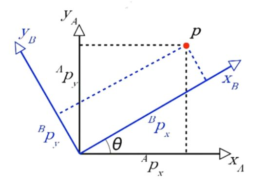
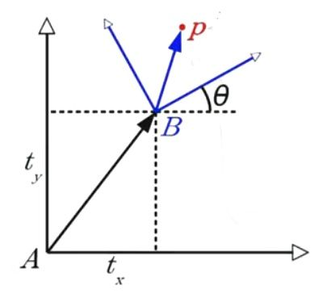
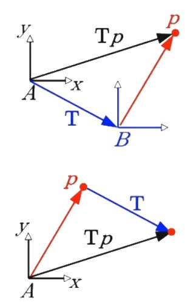
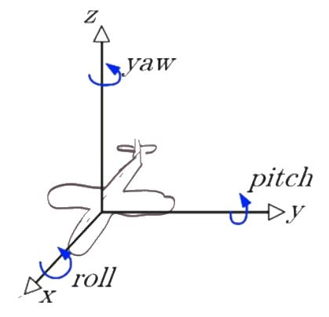

# Space and Transforms

## Representation of Transforms

$$^AT_B . ^Bp \; = \; ^Ap$$

Where $$^AT_B$$ represents translation matrix from reference frame A to reference frame B.

You can think of as the B from $$ ^AT_B $$ cancelling B from point $$ ^Bp $$ to get $$ ^Ap $$.

To perform muultiple transforms, you can chain transforms in the left side to get the point in the desired frame.

For exmaple,

$$^AT_B . ^BT_C . ^Cp \; = \; ^Ap$$

Which represents the transforms from reference frame C to reference frame A.

## Rotation

Representing the point p in reference frame B by transforming it to reference frame A.

$$^AT_B . ^Bp \; = \; ^Ap$$

If $$^Bp = [^Bp_X, ^Bp_Y] \; then \; ^Ap = ?$$

$$^Ap_X \; = \; ^Bp_X.cos(\theta) - ^BP_Y.sin(\theta)$$ 

$$^Ap_Y \; = \; ^Bp_X.sin(\theta) + ^BP_Y.cos(\theta)$$

$$^AP = \begin{bmatrix} ^Ap_x \\ ^Ap_y \end{bmatrix} = \begin{bmatrix} cos(\theta) & -sin(\theta) \\ sin(\theta) & cos(\theta)\end{bmatrix}. \begin{bmatrix} ^Bp_X \\ ^Bp_Y\end{bmatrix}$$

$$^AP \; = \;^AR_B . ^Bp$$

Where R represents the transformation from A to B which is a rotation matrix.

The rotation in 2D is asusumed to always happens in the Z-axis which is hidden.

Some properties of rotation matrices are:

* $$|R| = 1$$
* always orthonormal
* $$R^{-1} = R^T$$ \(derived form above 2 properties\)

## Homogenous Coordinates

Combining Rotations and Translations into a single operation by simply adding a 1 to your coordinates.

The homogenous point in a frame B is represented in homogenous form by

$$^BP = \begin{bmatrix} ^pp_X \\ ^Bp_Y \\ 1 \end{bmatrix}$$

And the transformation of a point from reference frame A to reference frame B after rotation and translation is given by:

$$^AT_B = \begin{bmatrix} ^AR_B & ^At_B \\ 0 & 1 \end{bmatrix}$$

Where $$ ^AR_B $$ is the rotation matrix and $$^At_B$$ is the translation matrix.

> Note: The above transform matrix also holds in 3-D space.

Then, the translation of a point $$p$$ from frame A to B is given by:

$$^Ap \; = \; ^AT_B.^Bp$$

## Different Perspectives - Getting Philosophical

Question: Is it me that is moving or is it the point P that is moving? kind of like - is it the flag that is moving or is it the wind that is moving?

Here, both of these transforms are identical. In the first one, the point is translated to reference frame B first and then the point p is observed. In the second one, the point p is first translated and then measured. In this one, the point p is assumed to be moving and as such, is translted by T first.

In both of these cases, the new point $$p^{NEW}$$ is calculated by $$T.p$$

## Rotation Representations \(All are interchangeable\)

* Rotation Matrix
* Axis - Angle -&gt; $$(a_x, a_y, a_z), \alpha$$
* Elementary Rotations -&gt; Roll, Pitch, Yaw Combining Elementary Rotations to make an Rotation around an Arbitrary Axis Roll, Pitch and Yaw might be a better representation than $$(a_x, a_y, a_z), \alpha$$ 
* Unit Quaternion -&gt; $$(g_x, g_y, g_z, g_w)$$

### Comparing representations

| Representation | Intuition | Chain | Memory | Numerical |
| :--- | :--- | :--- | :--- | :--- |
| Rotation Matrix | ✓ | ✓ | 9 | ❌ |
| Axis-Angle | ✓ | ❌ | 4 |  |
| Elementary Rotation | ✓ |  | 3 |  |
| Unit Quaternion | ✓ | ✓ | 4 | ✓ |

## Which representation is Good?

* Rotation Matrix is good for humans to look at, whereas, Unit Quaternion is good for computers to look at.
* Unit Quaterniion is better for Numerical, Memory and Chaining Operations

Any Rotation in Space can be specified by 3 Numbers. So it is 3 DOF.

Any Transform in Space is 6 DOF because it combines Rotation \(3 DOF\) and translation \(3 DOF\).

